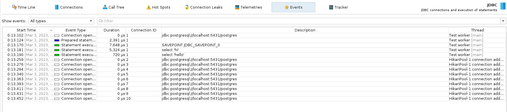

This demonstrates a possible bug in jProfiler 13.0.
The `SAVEPOINT` statement is registered and visible (in Database > JDBC > Events) but `RELEASE SAVEPOINT` is not.

To replicate:

1. Change the URL and credentials in the `app/src/test/java/release/savepoint/AppTest.java`.
2. Add breakpoint to the very beginning (so that the profiler will be able to connect; pause thread not JVM).
3. Start the test in debug mode
4. Connect with profiler; prevent JVM exit; enable Database capture and its Events capture.
5. Resume the program

The profiler will show the following events (`RELEASE SAVEPOINT` is missing):

